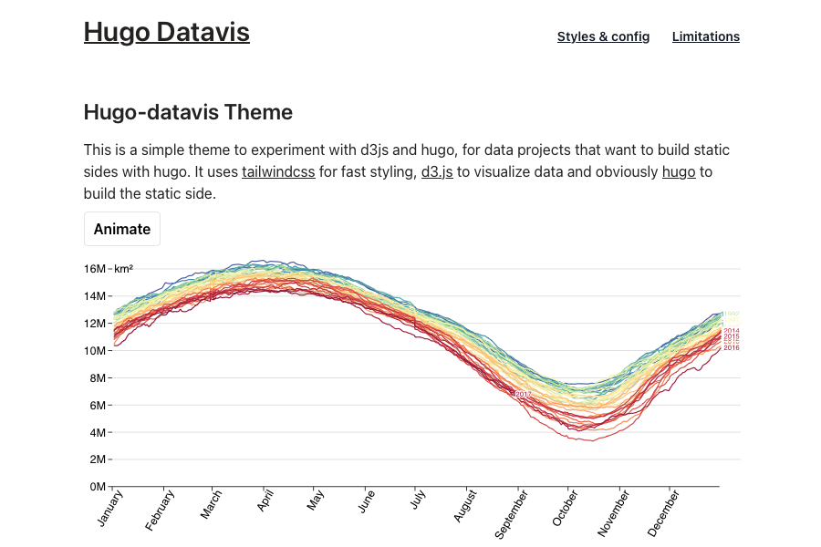

This page is adapted from the [markdownguide](https://www.markdownguide.org/) credit to them 👍.

## Basic Syntax

These are the elements outlined in John Gruber’s original design document. All Markdown applications support these elements.

### Heading

# H1
## H2
### H3

### Bold

**bold text**

### Italic

*italicized text*

### Blockquote

> This is a blockquote quote

> This is a blockquote quote
> which is getting a bit longer
> because there is so much to say.
> It really is a pretty long block quote

### Ordered List

1. First item
2. Second item
3. Third item

### Unordered List

- First item
- Second item
- Third item

### Code

`code`

### Horizontal Rule

---

### Link

[Link to main page](/)

### Image



## Extended Syntax

These elements extend the basic syntax by adding additional features. Not all Markdown applications support these elements.

### Table


|  | Some 1 | Some 2 | Some 3 | Some longer four | 5 | ThereIsALastColumn |
| :------ | :---: | :---: | :---: | :---: | :---: | :---: |
| Line long line 1 | + | + | + | + | - | + |
| Line 2 | + | + | - | (-) | + | - |
| Line 3 | + | + | + | (-) | + | - |
| Line 4 | + | - | + | - | - | - |
| Line5WithNoBlanks | - | (-) | - | - | - | - |
| Line 6 | - | + | - | - | - | - |

### Fenced Code Block

```
{
  "firstName": "John",
  "lastName": "Smith",
  "age": 25
}
```

### Footnote

Here's a sentence with a footnote. [^1]

[^1]: This is the footnote.

### Heading ID

### My Great Heading {#custom-id}

### Definition List

term
: definition

### Strikethrough

~~The world is flat.~~

### Task List

- [x] Write the press release
- [ ] Update the website
- [ ] Contact the media

### Subscript

H~2~O

